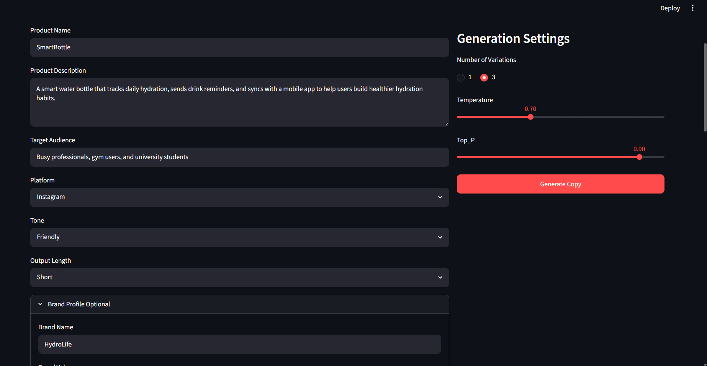
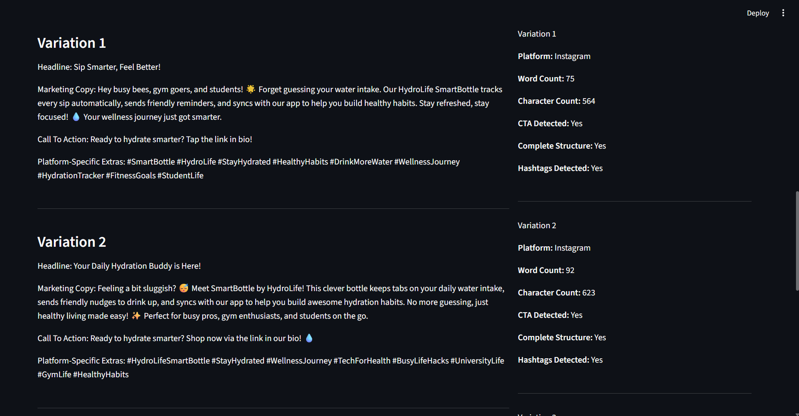
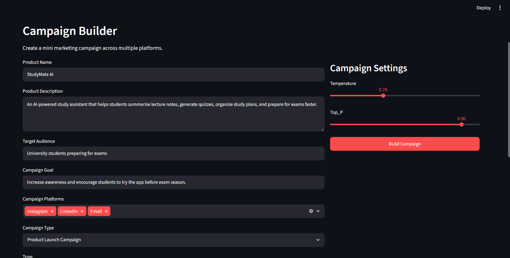
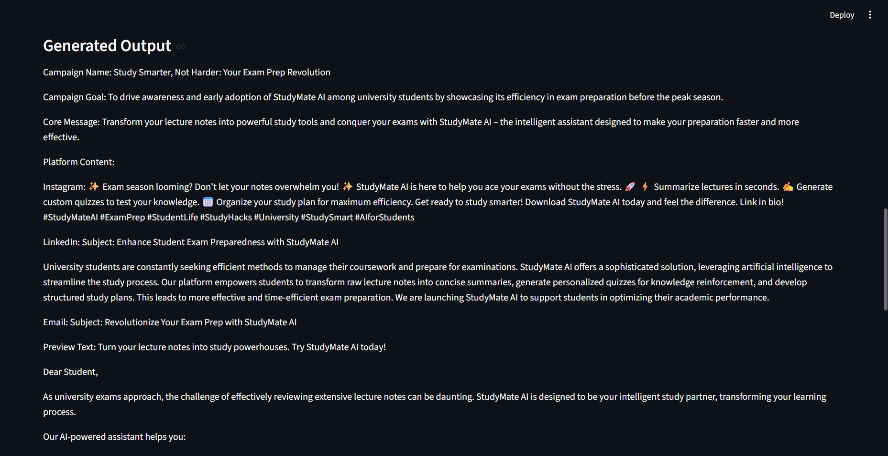
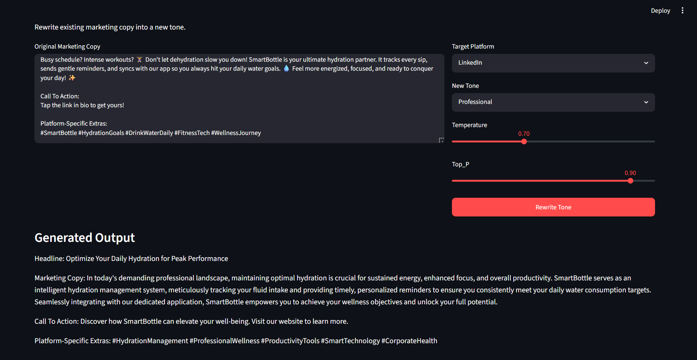
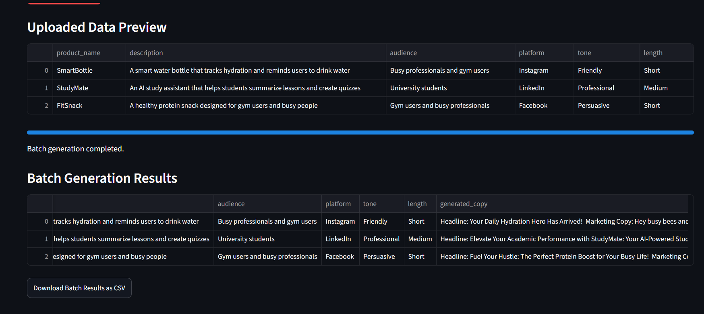

# CopyCraft AI

**CopyCraft AI** is an AI-powered marketing content studio that generates platform-specific marketing copy, builds mini campaigns, rewrites content into different tones, and supports batch content generation using CSV files.

The project was built as part of a Generative AI internship project focused on automated copywriting, tone transformation, dynamic prompt templates, and inference parameter tuning.

---

## Project Overview

CopyCraft AI helps users transform raw product descriptions into professional marketing content for different platforms such as Instagram, LinkedIn, Email, X/Twitter, and Facebook.

The application uses user-defined variables such as product name, product description, platform, audience, tone, brand voice, and output length. These variables are injected into structured dynamic prompts and passed to a generative AI model. The user can also control inference parameters such as Temperature and Top_P to adjust the creativity and diversity of the generated output.

---

## Features

### AI Copy Generator

Generate marketing copy for a single product based on:

* Product name
* Product description
* Target audience
* Platform
* Tone
* Output length
* Brand profile
* Temperature
* Top_P
* Number of variations

The output includes:

* Headline
* Marketing copy
* Call to action
* Platform-specific extras such as hashtags, email subject lines, or platform-focused content

---

### Campaign Builder

Create a complete mini marketing campaign across multiple platforms.

The Campaign Builder can generate:

* Campaign name
* Campaign goal
* Core message
* Platform-specific content
* Main call to action
* Hashtags
* Platform adaptation notes

This makes the app useful for creating full marketing campaign drafts instead of only single posts.

---

### Tone Rewriter

Rewrite existing marketing copy into a new tone while adapting it to a selected platform.

Example use case:

* Convert an Instagram-style caption into a professional LinkedIn post
* Rewrite casual content into persuasive content
* Make promotional copy more formal, friendly, or luxury-focused

---

### Batch Content Pipeline

Upload a CSV file containing multiple products and generate marketing copy for all rows.

The batch feature supports:

* CSV upload
* Data preview
* Multiple product processing
* Delay between API requests to reduce rate-limit errors
* Downloadable CSV results

---

### Brand Profile Control

The app includes optional brand profile fields:

* Brand name
* Brand voice
* Unique selling point
* Forbidden words

This helps keep generated content aligned with the intended brand identity.

---

### Quality Check

CopyCraft AI includes a simple rule-based quality checker that evaluates generated output using:

* Word count
* Character count
* CTA detection
* Complete structure detection
* Platform-specific checks
* Hashtag detection
* Email subject detection
* LinkedIn “link in bio” check

---

## Screenshots

### AI Copy Generator



---

### Copy Generation Result



---

### Campaign Builder Inputs



---

### Campaign Builder Output



---

### Tone Rewriter



---

### Batch Content Pipeline



---

## Tech Stack

* Python
* Streamlit
* Google Gemini API
* Pandas
* python-dotenv

---

## Project Structure

```text
copycraft-ai/
│
├── app.py
├── config.py
├── generator.py
├── prompt_templates.py
├── quality_checker.py
├── batch_processor.py
│
├── requirements.txt
├── .env.example
├── .gitignore
├── sample_products.csv
│
└── screenshots/
    ├── ai_copy_generator.png
    ├── copy_generation_result.png
    ├── campaign_builder_inputs.png
    ├── campaign_builder_output.png
    ├── tone_rewriter.png
    └── batch_content_pipeline.png
```

---

## How It Works

CopyCraft AI follows a structured generation pipeline:

1. The user enters product, audience, platform, tone, and brand details.
2. The app compiles these inputs into a dynamic prompt template.
3. The prompt is sent to the Gemini model with selected inference parameters.
4. The model generates platform-specific marketing content.
5. The app validates the output using rule-based quality checks.
6. The user can download the generated content as TXT, JSON, or CSV.

---

## Inference Parameter Tuning

The app allows users to control:

### Temperature

Controls creativity and randomness.

* Lower values produce more stable and predictable output.
* Higher values produce more creative and varied output.

### Top_P

Controls token sampling diversity.

* Lower values make the model more focused.
* Higher values allow more diverse phrasing.

These parameters allow users to experiment with different levels of creativity depending on the platform and marketing goal.

---

## CSV Batch Format

The batch content pipeline expects a CSV file with the following columns:

```csv
product_name,description,audience,platform,tone,length
SmartBottle,A smart water bottle that tracks hydration and reminds users to drink water,Busy professionals and gym users,Instagram,Friendly,Short
StudyMate AI,An AI study assistant that summarizes notes and creates quizzes,University students,LinkedIn,Professional,Medium
EcoBag,A reusable shopping bag made from recycled materials,Environmentally conscious shoppers,Facebook,Persuasive,Short
```

---

## Installation

### 1. Clone the repository

```bash
git clone https://github.com/your-username/copycraft-ai.git
cd copycraft-ai
```

### 2. Create a virtual environment

```bash
py -m venv venv
```

### 3. Activate the virtual environment

For Windows:

```bash
venv\Scripts\activate
```

For macOS/Linux:

```bash
source venv/bin/activate
```

### 4. Install dependencies

```bash
pip install -r requirements.txt
```

### 5. Add environment variables

Create a `.env` file in the project folder:

```env
GEMINI_API_KEY=your_api_key_here
GEMINI_MODEL=gemini-2.5-flash
```

Do not upload the `.env` file to GitHub.

---

## Running the App

```bash
streamlit run app.py
```

Then open the local URL shown in the terminal.

---

## Environment Variables

The project uses the following environment variables:

```env
GEMINI_API_KEY=your_api_key_here
GEMINI_MODEL=gemini-2.5-flash
```

An example file is included as:

```text
.env.example
```

---

## Error Handling

The app includes cleaner error handling for common API issues such as:

* Missing API key
* Invalid model name
* Rate-limit errors
* Temporary model overload
* Incomplete model responses

Instead of crashing, the app displays user-friendly messages and suggests actions such as waiting, reducing batch size, or increasing delay between requests.

---

## Sample Use Cases

CopyCraft AI can be used to:

* Generate Instagram product captions
* Create LinkedIn promotional posts
* Draft email campaign copy
* Rewrite casual copy into a professional tone
* Generate marketing content for multiple products from a CSV file
* Build mini product launch campaigns

---

## What I Learned

Through this project, I practiced:

* Building a Streamlit AI application
* Connecting a generative AI API to a Python app
* Designing dynamic prompt templates
* Using Temperature and Top_P for inference control
* Creating platform-specific content generation logic
* Handling API errors and rate limits
* Processing CSV files for batch generation
* Structuring a Python project into clean modules

---

## Future Improvements

Possible future improvements include:

* Adding user authentication
* Deploying the app online
* Adding prompt preview for debugging
* Adding copy scoring out of 100
* Supporting more platforms
* Saving generation history
* Exporting results as PDF or DOCX
* Adding multilingual copy generation

---

## Project Status

Completed as a functional Generative AI application for automated copywriting, campaign generation, tone rewriting, and batch content processing.
